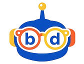

<div align="center">



# Readapt

### Veja Além das Letras

Sistema tecnológico educacional que combina robótica, óculos inteligentes, inteligência artificial e gamificação para auxiliar crianças com dislexia durante o processo de aprendizagem da leitura.

</div>

---

## 📖 Sobre o Projeto

O **Readapt** é uma solução educacional desenvolvida para tornar a leitura mais acessível para crianças com dislexia.

O projeto integra hardware e software em um único ecossistema composto por:

- 🤖 Robô Educacional
- 👓 Óculos Inteligentes
- 📱 Aplicativo Mobile
- 🎮 Jogo Educativo
- 🤖 Inteligência Artificial
- 📷 Reconhecimento Óptico de Caracteres (OCR)

A proposta é transformar o aprendizado em uma experiência interativa, personalizada e motivadora.

---

## ✨ Funcionalidades

- Sistema de leitura assistida
- OCR para identificação de textos
- Integração entre robô e óculos inteligentes
- Aplicativo para gerenciamento dos dispositivos
- Manual interativo
- Referências científicas
- Jogo educativo "Boss Against Dyslexia"
- Modo Escuro
- Layout Responsivo

---

## 🛠 Tecnologias

### Front-end

- HTML5
- CSS3
- JavaScript

### Hardware

- ESP32 WROOM
- Câmera ESP32-CAM
- Sensores Inteligentes

### Inteligência Artificial

- OCR
- Processamento de Texto
- Assistência em Tempo Real

---

## 📱 Estrutura do Site

- Home
- Instruções
- Produtos
- Quem Somos
- Referências
- Game

---

## 📂 Estrutura do Projeto

```text
Readapt/
│
├── assets/
│
├── css/
│   ├── style.css
│   ├── instrucoes.css
│   ├── produto.css
│   ├── quem-somos.css
│   ├── referencias.css
│   └── game.css
│
├── js/
│   └── script.js
│
├── index.html
├── instrucoes.html
├── produto.html
├── quem-somos.html
├── referencias.html
└── game.html
```

---

## 🚀 Como Executar

1. Clone o repositório

```bash
git clone https://github.com/Chxvzy/Readapt.git
```

2. Abra a pasta do projeto.

3. Execute o arquivo:

```text
index.html
```

ou utilize a extensão **Live Server** no Visual Studio Code.

---

## 🎯 Objetivo

O objetivo do Readapt é utilizar tecnologia para reduzir as dificuldades enfrentadas por crianças com dislexia, oferecendo uma plataforma que une educação, acessibilidade e inovação.

---

## 👨‍💻 Equipe

Desenvolvido por:

- Felipe Lorenzo
- Guilherme *(adicione o sobrenome se desejar)*

---

## 📄 Licença

Este projeto foi desenvolvido para fins acadêmicos e de pesquisa.

---

<div align="center">

### Readapt

**Veja Além das Letras**

</div>